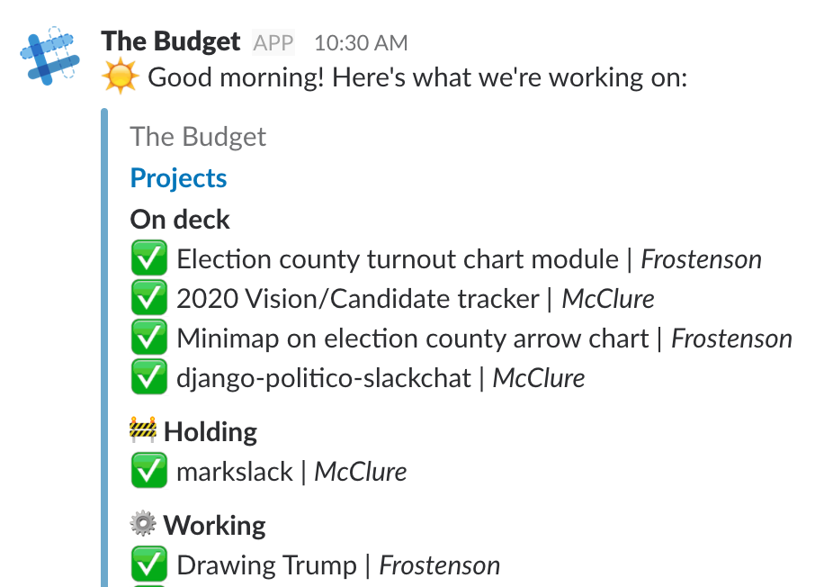

# django-kanban-budget

A dead simple kanban-style project management application with tiny GitHub and Slack integrations.


### Budget?

In newspaper-speak, "budget" refers to a list of stories to be published in the next day's paper and the space and pages allotted to them.

## Quickstart

1. Install the app.

  ```
  $ pip install django-kanban-budget
  ```

2. Add the app and dependencies to `INSTALLED_APPS` in your project settings.

  ```python
  # project/settings.py

  INSTALLED_APPS = [
      # ...
      'rest_framework',
      'django_filters',
      'budget',
  ]
  ```
3. Add additional configuration settings.

  ```python
  # project/settings.py

  BUDGET_SECRET_TOKEN = 'SECRETTOKEN' # An arbitrary token
  BUDGET_DOMAIN = 'http://localhost:8000' # The root domain of your hosted project
  ```

4. Add to project urls.

  ```python
  # project/urls.py

  urlpatterns = [
      url(r'^admin/', admin.site.urls),
      # ...
      url(r'^budget/', include('budget.urls')),
  ]
  ```

5. Configure Celery for your project (cf. [First Steps with Django](http://docs.celeryproject.org/en/latest/django/first-steps-with-django.html)).

  ```python
  # project/celery.py
  import os

  from celery import Celery
  from django.conf import settings

  os.environ.setdefault('DJANGO_SETTINGS_MODULE', '<your_app>.settings')

  app = Celery('<your_app>')
  app.config_from_object('django.conf:settings', namespace='CELERY')
  app.conf.update(
    task_serializer='json'
  )
  # Use synchronous tasks in local dev
  if settings.DEBUG:
      app.conf.update(task_always_eager=True)
  app.autodiscover_tasks(lambda: settings.INSTALLED_APPS, related_name='celery')
  ```

  ```python
  # project/__init__.py
  from .celery import app as celery_app

  __all__ = ['celery_app']
  ```

5. Run migrations.

  ```
  $ python manage.py migrate budget
  ```

6. Create some boards and columns in the admin, and you're ready to budget!

## Why this?

> Before you select a tool, you must first intimately understand the problem you’re trying to solve. And the best way to do that, IMHO, is to do it by hand.

> *Brian Boyer, ["That one free tool"](https://npr.design/that-one-free-tool-ab585438696d)*

This app springs from a system of notecards that got me through a job running a data & dev team in a regional newsroom. The cards were tacked up, Kanban-style, to the high walls of our soviet-era cubicles, as low-fi a project management system as I could think of.

Their real novelty was that they forced us to be [radically transparent](https://hbr.org/2017/10/radical-transparency-can-reduce-bias-but-only-if-its-done-right) about our own priorities. The cards were tacked up under columns with weird names like "Blue Sky" and "House on Fire" that had real meaning to our workflow and exposed our peers to the breadth of our work, which was not always well understood.

When a senior editor had a pet project, she had to recognize its place among our other priorities. If a reporter had a good idea, we made room for it together. If our own ideas didn't beat out others in the queue, we killed our darlings.

Most importantly, the cards were always up, the literal backdrop to every conversation at our desks. We could skip the daily recitals in our newsroom budget meetings because, critically, we removed the notion of convening authority from the budget: Everyone was responsible for it, no longer a function of an editorial set piece.

_So, why go digital?_

A few reasons:

At POLITICO, we work with reporters across the country and in Europe who can't make it to our team's desks for a chat. Messaging apps like Slack have also become a habitual space to share early ideas and check the status of projects. Adding dynamic filtering to project cards also lets us have many views of our boards, a simultaneous team view and personal view, among the most important.

How we organize boards and columns and what the atomic-unit of a card represents has changed over time. This app supports the continuing development of those concepts.

_Why this app and not Trello/Asana/waffle.io/whatever?_

First off, they're all great! It's just that they all had _too much stuff_. This app has just what we found we needed and nothing more. That includes some super low-functioning integrations with the two main platforms in our world, GitHub and Slack. We also like having the ability to grow or kill features at our own pace.

Most importantly, owning our own project management tool lets us weave the spirit and early lessons of the notecard system it's based on into the design.


## Additional configuration


### Configuring users

django-kanban-budget uses Django's standard `User` auth model to associate people with projects. You can set custom roles to determine who is a developer, editor or reporter in your system.

Set custom attribute calls to the `User` model in your settings. The attributes should return a boolean value that determines that user's available roles.

Say, for example, you had a model like this:

```python
class Profile(models.Model):
  user = models.OneToOneField(User, on_delete=models.CASCADE)
  is_reporter = models.BooleanField(default=False)
  # ... etc.
```

You could set the reporter attribute in your project settings like this:

```python
BUDGET_REPORTER_ATTR = 'profile.is_reporter'
```

By default, the app uses the `User` models `is_staff` method to determine reporters and editors and `is_superuser` to find developers:

```python
# defaults
BUDGET_REPORTER_ATTR = 'is_staff'
BUDGET_EDITOR_ATTR = 'is_staff'
BUDGET_DEVELOPER_ATTR = 'is_superuser'
```

### Configuring authentication

The app uses the `BUDGET_SECRET_TOKEN` you set in your project settings to verify API requests to create and update projects. **It's critical, then, that you secure board pages so that token isn't sent to unauthenticated users.**

By default, pages are restricted to logged-in users, but you can use any callable authentication decorator. Just set `BUDGET_AUTH_DECORATOR` in your project settings to the string module path of a valid authentication decorator. For example, to restrict the app to staff members:

```python
# settings.py
BUDGET_AUTH_DECORATOR = "django.contrib.admin.views.decorators.staff_member_required"
```

### Setting up GitHub integration

django-kanban-budget can create a link between a GitHub repo and a project card, allowing you to sync issues on the repo with TODOs in the app. Just add the root HTTP URL for the repo as the GitHub link on your project card. For example, `https://github.com/The-Politico/django-kanban-budget`.

Once you associate a GitHub repo with a project, the app will intercept any new issues on the repo and create a corresponding TODO in the app. Vice versa, if you create a new TODO in the app, it will create a corresponding issue on the repo. Closing an issue will delete a TODO, and deleting a TODO will close an issue, etc.

To use this integration, you'll need to configure a GitHub webhook. Be sure to checkout the GitHub [docs on that](https://developer.github.com/webhooks/) for a detailed intro. Once you get the basic idea, here's how to setup the integration with the app:

1. Create a webhook from the settings page of your org or personal GitHub account.
2. Configure the Payload URL to hit the app's webhook endpoint.
  ```
  https://<your app domain>/budget/webhook/github/
  ```
3. Make sure the `Content type` is set to `application/json`.
4. For security, use the `BUDGET_SECRET_TOKEN` you set in your project settings as the `Secret` key for the webhook.
5. We recommend you select individual events to trigger your webhook. Make sure you at least select the `Issues` events.
6. Now set the required configuration in your project settings.
  ```python
  BUDGET_GITHUB_ORG = 'An-Org' # Either an org or person required
  BUDGET_GITHUB_PERSON = 'A-User'
  BUDGET_GITHUB_TOKEN = os.getenv('BUDGET_GITHUB_TOKEN') # A GitHub user API token
  ```

### Setting up Slack notifications

You can configure Slack notifications from your budget boards.

First add some configuration variables to your project settings:

```python
BUDGET_SLACK_TOKEN = os.getenv('BUDGET_SLACK_TOKEN')  # A Slack API token
BUDGET_DOMAIN = 'http://localhost:8000'  # The root domain of your hosted app
```

For each board you want to send the status of, add a Slack channel slug to the model. (Do it in the admin!)

```python
a_board.slack_channel = '#my-channel'
```

Now the app will send a notification to the designated Slack channel whenever a new project card is created.

To periodically send a notification that lists all the projects on a board, configure a process on your server to call the Slack notification management command with the slugs of any board you want:

```
$ python manage.py budget_board_status slug-of-a-board another-board
```



### Customizing the look

We recommend [overriding the templates](https://docs.djangoproject.com/en/2.0/howto/overriding-templates/) `budget/override_home.html` and  `budget/override_board.html` in your Django project to change the style of the budget to better match your org.

See the templates `budget/board.html` and `budget/home.html` for template blocks you can override.

## Developing

Frontend assets are compiled using  [generator-politico-django](http://generator-politico-django.readthedocs.io/en/latest/).

To develop, first remove built assets from the `static` directory, then run gulp form the `staticapp` directory:

```
$ rm -rf budget/static/css
$ rm -rf budget/static/js
$ cd budget/staticapp
$ gulp
```

The app will automatically start Django's development server and proxy it with Webpack hot module replacement at [http://localhost:3000](http://localhost:3000).

Once you're done developing, re-build your assets to the `static` directory:

```
$ gulp build
```
