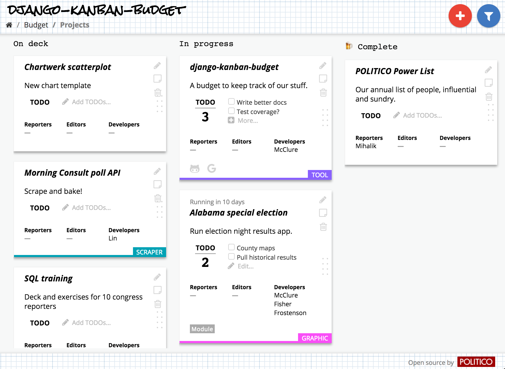

# django-kanban-budget

A Kanban-style project management app to help management development projects in a newsroom.



### Budget?

In newsroom-speak, "budget" refers to the stories to be published and the space and pages allotted to them in the next day's paper. It has nothing to do with $$$.

### Quickstart

1. Install the app.

  ```
  $ pip install django-kanban-budget
  ```

2. Add the app and dependencies to `INSTALLED_APPS` in your project settings.

  ```python
  # settings.py

  INSTALLED_APPS = [
      # ...
      'rest_framework',
      'django_filters',
      'budget',
  ]
  ```
3. Add additional configuration settings.

  ```python
  # settings.py

  BUDGET_SECRET_TOKEN = 'SECRETTOKEN' # An arbitrary token
  BUDGET_DOMAIN = 'http://localhost:8000' # The root domain of your hosted project
  ```

4. Add to project urls.

  ```python
  # urls.py

  urlpatterns = [
      url(r'^admin/', admin.site.urls),
      # ...
      url(r'^budget/', include('budget.urls')),
  ]
  ```

5. Run migrations.

  ```
  $ python manage.py migrate budget
  ```

6. Create some boards and columns in the admin, and you're ready to budget!


### Configuring users

django-kanban-budget uses Django's standard `User` auth model to associate people with projects. You can, however, set custom roles to determine who is a developer, editor or reporter in your system.

Set custom attribute calls on the user model in your settings. The attributes should return a boolean value that determines that user's available roles.

This lets you extend the `User` model elsewhere in your project and use custom attributes to determine roles in the budget.

Say, for example, you had a model like this:

```python
class Profile(models.Model):
  user = models.OneToOneField(User, on_delete=models.CASCADE)
  is_reporter = models.BooleanField(default=False)
  # ... etc.
```

You could set the reporter attribute in your project settings like this:

```python
BUDGET_REPORTER_ATTR = 'profile.is_reporter'
```

Here are the defaults:

```python
BUDGET_REPORTER_ATTR = 'is_staff'
BUDGET_EDITOR_ATTR = 'is_staff'
BUDGET_DEVELOPER_ATTR = 'is_superuser'
```

### Configuring authentication

The app uses the `BUDGET_SECRET_TOKEN` you set in your project settings to verify API requests to create and update projects. **It's critical, then, that you secure board pages so that token isn't sent to unauthenticated users.**

By default, pages are restricted to logged-in users, but you can use any callable authentication decorator. Just set `BUDGET_AUTH_DECORATOR` in your project settings to the string module path of a valid authentication decorator. For example, to restrict the app to staff members:

```python
# settings.py
BUDGET_AUTH_DECORATOR = "django.contrib.admin.views.decorators.staff_member_required"
```

### Setting up GitHub integration

django-kanban-budget can create a link between a GitHub repo and a project card, allowing you to sync issues on the repo with TODOs in the app. Just add the root HTTP URL for the repo as the GitHub link on your project card. For example, `https://github.com/The-Politico/django-kanban-budget`.

Once you associate a GitHub repo with a project, the app will intercept any new issues on the repo and create a corresponding TODO in the app. Vice versa, if you create a new TODO in the app, it will create a corresponding issue on the repo. Closing an issue will delete a TODO, and deleting a TODO will close an issue, etc.

To use this integration, you'll need to configure a GitHub webhook. Be sure to checkout the GitHub [docs on that](https://developer.github.com/webhooks/) for a detailed intro. Once you get the basic idea, here's how to setup the integration with the app:

1. Create a webhook from the settings page of your org or personal GitHub account.
2. Configure the Payload URL to hit the app's webhook endpoint.
  ```
  https://<your app domain>/budget/webhook/github/
  ```
3. Make sure the `Content type` is set to `application/json`.
4. For security, use the `BUDGET_SECRET_TOKEN` you set in your project settings as the `Secret` key for the webhook.
5. We recommend you select individual events to trigger your webhook. Make sure you at least select the `Issues` events.
6. Now set the required configuration in your project settings.
  ```python
  BUDGET_GITHUB_ORG = 'An-Org' # Either an org or person required
  BUDGET_GITHUB_PERSON = 'A-User'
  BUDGET_GITHUB_TOKEN = os.getenv('BUDGET_GITHUB_TOKEN') # A GitHub user API token
  ```

### Setting up Slack notifications

You can configure Slack notifications from your budget boards.

First add some configuration variables to your project settings:

```python
BUDGET_SLACK_TOKEN = os.getenv('BUDGET_SLACK_TOKEN')  # A Slack API token
BUDGET_DOMAIN = 'http://localhost:8000'  # The root domain of your hosted app
```

For each board you want to send the status of, add a Slack channel slug to the model. (Do it in the admin!)

```python
a_board.slack_channel = '#my-channel'
```

Now the app will send a notification to the designated Slack channel whenever a new project card is created.

To periodically send a notification that lists all the projects on a board, configure a process on your server to call the Slack notification management command with the slugs of any board you want:

```
$ python manage.py budget_board_status slug-of-a-board another-board
```

### Developing

Frontend assets are compiled using  [generator-politico-django](http://generator-politico-django.readthedocs.io/en/latest/).

To develop, first remove built assets from the `static` directory, then run gulp form the `staticapp` directory:

```
$ rm -rf budget/static/css
$ rm -rf budget/static/js
$ cd budget/staticapp
$ gulp
```

The app will automatically start Django's development server and proxy it with Webpack hot module replacement at [http://localhost:3000](http://localhost:3000).

Once you're done developing, re-build your assets to the `static` directory:

```
$ gulp build
```
